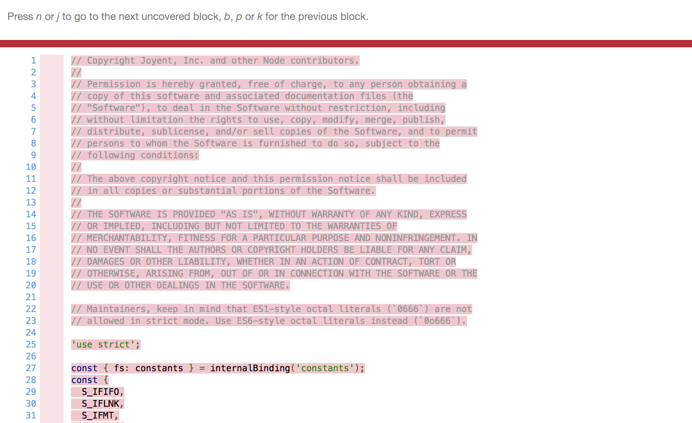
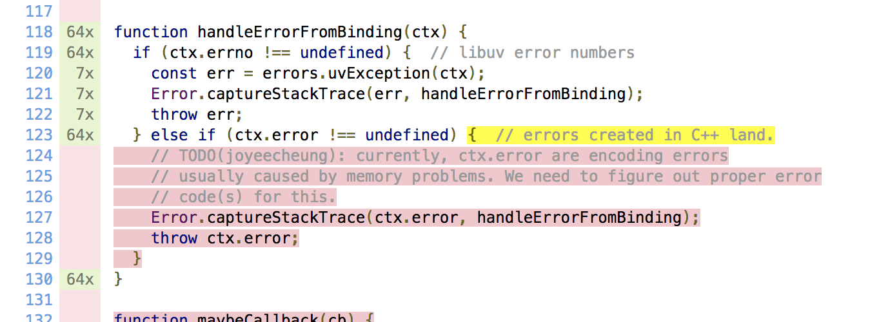

# Coverage Weirdness in Node.js

## Problem I'm Seeing

For some of the internal modules in Node.js, it seems that the coverage reported
by the inspector does not include the outer most block:



This should not be possible, given that it does contain coverage for deeper
blocks within the AST.



## Creating This Output

I created the output shared in this repo by running:

```bash
NODE_V8_COVERAGE=./cov ./tools/test.py test/parallel/test-fs-mkdir.js
```
